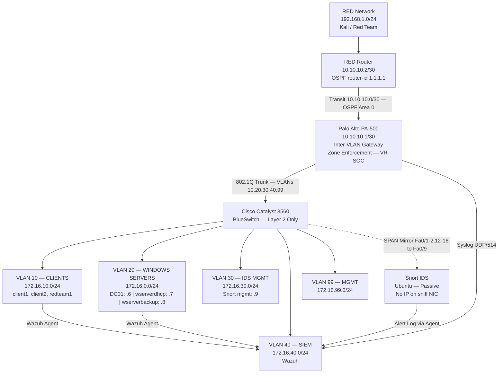

# Network Security Operations Lab

**Enterprise-style SOC and Incident Response lab built on physical hardware using Palo Alto PA-500 firewall segmentation, Cisco Catalyst switching, Windows Active Directory, Wazuh SIEM, and Snort IDS.**

---

## Overview

This project documents the design, build, configuration, validation, and demonstration of a physical Network Security Operations lab built to simulate real enterprise defensive security workflows.

The lab was proposed, architected, and built as a student-led technical project. Contributions included designing the network proposal, configuring major infrastructure components, writing implementation guides, validating every layer of the stack, and leading technical demonstrations for other students.

The lab follows a **baseline-first methodology**: infrastructure is built and validated, normal behavior is documented, then detection and monitoring layers are added on top. This is the correct sequence for building a defensible and observable network environment.

> **Ethical Scope:** All testing is conducted within an owned, isolated lab environment. No scanning, enumeration, or adversary simulation is directed at external or unauthorized systems.

---

## My Role

- Proposed the network architecture and designed the lab topology
- Configured Palo Alto PA-500 subinterfaces, zones, and security policy
- Configured Cisco Catalyst 3560 VLANs, trunking, and SPAN port mirroring
- Built and validated the Active Directory domain with DNS, DHCP, and NTP
- Deployed Wazuh SIEM and enrolled Windows and Linux agents
- Set up Snort IDS with dual-NIC passive architecture
- Created implementation guides and step-by-step runbooks
- Led technical demonstrations and explained the architecture to other students
- Documented configurations, validation commands, and detection scenarios

---

## Skills Demonstrated

| Domain | Skills |
|---|---|
| Network Design | VLAN segmentation, 802.1Q trunking, inter-VLAN routing, subnetting, OSPF |
| Firewall | Palo Alto PA-500 — subinterfaces, zones, policy enforcement, syslog |
| Switching | Cisco Catalyst 3560 — VLAN config, trunking, SPAN/mirror port |
| Identity & Services | Windows Server 2016, AD DS, DNS, DHCP, NTP, OU design, domain join |
| SIEM | Wazuh — agent deployment, Windows log ingestion, multi-source collection |
| IDS | Snort — passive dual-NIC deployment, SPAN integration, alert validation |
| Security Operations | Baseline analysis, log correlation, alert triage, detection scenarios |
| Documentation | Runbooks, detection guides, evidence checklists, IR methodology |
| Physical Lab | Rack setup, cable management, hardware integration, real device troubleshooting |

---

## Architecture



---

## Hardware and Software Stack

### Hardware

| Device | Role | Notes |
|---|---|---|
| Palo Alto PA-500 | Firewall / inter-VLAN gateway / zone enforcement | Reset to factory before final config |
| Cisco Catalyst 3560 (BlueSwitch) | Layer 2 switch — VLANs, trunk, SPAN | Layer 2 only by design |
| Cisco Router (Red) | RED network gateway / OSPF peer | FastEth0/1 = 192.168.1.1/24 |
| Windows Server 2016 × 3 | AD DS + DNS, DHCP, Backup/File share | All domain-joined |
| Windows 10 clients × 2 | Domain-joined endpoints | client1, client2 |
| Red team hosts × 1+ | Adversary simulation | redteam1 in VLAN 10 during demo |
| Ubuntu Server | Snort IDS sensor | Dual NIC — PCIe card added |
| Dedicated host | Wazuh SIEM | All-in-one deployment |

### Software

| Component | Details |
|---|---|
| PAN-OS | Palo Alto PA-500 production image |
| Cisco IOS | Catalyst 3560 and Red router |
| Windows Server 2016 | Standard Evaluation |
| Windows 10 Pro | 10.0.19045.x (clients) |
| Wazuh | 4.x all-in-one via install script |
| Snort | v2.x on Ubuntu Server |
| Kali Linux | Installed via VirtualBox on red team hosts |

---

## Network Design

### Confirmed VLAN Table (from `show vlan brief` screenshot)

| VLAN | Name | Subnet | Gateway | Switch Ports |
|---|---|---|---|---|
| 10 | CLIENTS | 172.16.10.0/24 | 172.16.10.1 | Fa0/13–16 |
| 20 | WINDOWSSERVER | 172.16.20.0/24 | 172.16.0.1* | Fa0/14–15, Fa0/16 |
| 30 | IDSMIRROR | 172.16.30.0/24 | 172.16.30.1 | Fa0/9–11 |
| 40 | SIEM | 172.16.40.0/24 | 172.16.40.1 | Fa0/12 |
| 99 | MGMT | 172.16.99.0/24 | 172.16.99.1 | Fa0/24 |


### Transit Network (Confirmed from router screenshots)

| Segment | Address |
|---|---|
| Transit subnet | 10.10.10.0/30 |
| Palo Alto ethernet1/1 | 10.10.10.1/30 |
| RED router | 10.10.10.2/30 |
| RED LAN (Fa0/1) | 192.168.1.1/24 |

### Confirmed Palo Alto Subinterfaces (from PA interface screenshot)

| Interface | IP | VLAN Tag | Zone | Comment |
|---|---|---|---|---|
| ethernet1/1 | 10.10.10.1/30 | Untagged | RED-TRANSIT | Transit to RED router |
| ethernet1/2 | none | Untagged | — | Trunk to BlueSwitch |
| ethernet1/2.10 | 172.16.10.1/24 | 10 | CLIENTS | Client gateway |
| ethernet1/2.20 | 172.16.0.1/24 | 20 | WINDOWS-SERVERS | Server gateway |
| ethernet1/2.30 | 172.16.30.1/24 | 30 | IDS-MGMT | Snort mgmt gateway |
| ethernet1/2.40 | 172.16.40.1/24 | 40 | SIEM | Wazuh gateway |
| ethernet1/2.99 | 172.16.99.1/24 | 99 | MGMT | Management gateway |
| ethernet1/3 | Dynamic DHCP | Untagged | internet temporal | Temporary internet |

All interfaces assigned to Virtual Router: **VR-SOC**

---

## Security Zones

| Zone | Interface | Purpose |
|---|---|---|
| RED-TRANSIT | ethernet1/1 | Adversary segment / OSPF transit |
| CLIENTS | ethernet1/2.10 | User workstations, domain-joined clients |
| WINDOWS-SERVERS | ethernet1/2.20 | AD DS, DNS, DHCP, file share, backup |
| IDS-MGMT | ethernet1/2.30 | Snort IDS management interface |
| SIEM | ethernet1/2.40 | Wazuh SIEM platform |
| MGMT | ethernet1/2.99 | Administrative access |

---

## Active Directory and Windows Infrastructure

### Domain Environment

| Role | Hostname | IP | OS |
|---|---|---|---|
| Primary DC / DNS | DC01 (domain controller) | 172.16.0.6 | Windows Server 2016 |
| DHCP Server | wserverdhcp | 172.16.0.7 | Windows Server 2016 |
| Backup / File Share | wserverbackup | 172.16.0.8 | Windows Server 2016 |
| Client 1 | client1 | 172.16.10.4 | Windows 10 Pro |
| Client 2 | client2 | 172.16.10.10 | Windows 10 Pro |
| Red team | redteam1 | 172.16.10.103 | Windows 10 Pro |

All three Windows Server hosts and the Windows 10 clients are domain-joined. The backup server hosted a public shared folder (`\\wserverbackup\Share`) used for SMB access validation testing.

Three AD users were created for demo scenarios: `aduser1`, `aduser2`, `aduser3`.

### Services

| Service | Host | Status |
|---|---|---|
| AD DS | DC01 | Deployed |
| DNS | DC01 | Deployed and validated |
| DHCP | wserverdhcp | Deployed with scopes |
| NTP | DC01 (domain time) | Active via domain membership |
| File Share | wserverbackup | Public share for demo |

---

## Wazuh SIEM — Confirmed from Screenshots

Five active agents confirmed (Agent List screenshot, May 12):

| Agent ID | Name | IP | OS |
|---|---|---|---|
| 001 | client1 | 172.16.10.4 | Windows 10 Pro 10.0.19045.6456 |
| 002 | client2 | 172.16.10.10 | Windows 10 Pro 10.0.19045.6456 |
| 003 | redteam1 | 172.16.10.103 | Windows 10 Pro 10.0.19045.2965 |
| 004 | wserverbackup | 172.16.0.8 | Windows Server 2016 Standard Eval |
| 005 | wserverdhcp | 172.16.0.7 | Windows Server 2016 Standard Eval |

**All 5 agents: Active, 0 disconnected.**

Wazuh dashboard confirmed (May 12, 14:02 screenshot):
- **20,887 total events** collected
- **8 authentication failures** detected
- **233 authentication successes** logged
- MITRE ATT&CK framework mapping active
- Top agents contributing: client1, client2, redteam1, wserverbackup, wserverdhcp

---

## Snort IDS — SPAN Configuration Confirmed

SPAN session confirmed from BlueSwitch screenshot:

```
monitor session 1 source interface Fa0/1 - 2, Fa0/12 - 16
monitor session 1 destination interface Fa0/9
```

- Source ports: upstream firewall port, SIEM port, and client access ports
- Destination: Fa0/9 (connected to Snort sniffing NIC)
- Snort management IP: 172.16.30.9 (VLAN 30)
- Sniffing NIC: no IP address (confirmed by design; required for passive operation)

Port security also confirmed active on access ports (Fa0/1–4) with sticky MAC learning and violation mode `restrict`.

---

## Detection and Validation Scenarios (Completed)

All scenarios executed during lab demonstration:

| # | Scenario | Systems | Event IDs / Detection |
|---|---|---|---|
| 1 | View active Wazuh agents | All enrolled hosts, Wazuh | Agent status: Active |
| 2 | Nmap ping sweep (authorized) | Kali/redteam1 → 172.16.20.0/24 | Wazuh / Snort / firewall logs |
| 3 | Nmap port scan against server | Kali → 172.16.0.6 | Port scan detection, service enumeration |
| 4 | SMB failed login (brute-force sim) | Kali → 172.16.0.6 | Windows Event 4625 in Wazuh |
| 5 | Successful login after failures | Domain user → client/server | Windows Event 4624 — correlation |
| 6 | SMB shared folder access | client → \\wserverbackup\Share | Windows Events 5140, 5145 |
| 7 | File creation on shared folder | client → demo-alert.txt | Wazuh syscheck / FIM alert |
| 8 | Wazuh agent validation | All agents | Endpoint summary dashboard |

All scenarios documented with: objective, steps, expected log events, and evidence screenshots.

---

## Evidence

**Confirmed captured evidence (from provided screenshots):**

- ✅ Cisco BlueSwitch VLAN table (`show vlan brief`)
- ✅ Cisco BlueSwitch SPAN session config (`monitor session 1`)
- ✅ Cisco port security config (Fa0/1–4, sticky MAC, restrict)
- ✅ Palo Alto subinterface table (all zones confirmed)
- ✅ RED router interface config (192.168.1.1/24, Fa0/1)
- ✅ RED router OSPF config (process 1, area 0, router-ID 1.1.1.1)
- ✅ Wazuh agent list (5 active agents, zero disconnected)
- ✅ Wazuh threat monitoring dashboard (20,887 events, MITRE mapping)

**Additional evidence planned for upload:**
- [ ] Rack and cable management photo
- [ ] AD OU structure screenshot
- [ ] DNS validation (`nslookup dc01.soc.lab`)
- [ ] DHCP scope and lease screenshot
- [ ] Snort console alert output
- [ ] Wazuh investigation timeline from a detection scenario
- [ ] Palo Alto Traffic Monitor logs (inter-VLAN and deny entries)

> All evidence is sanitized before upload. Remove: passwords, license keys, serial numbers, public IPs, personal names, private email addresses, tokens, full firewall backups, and sensitive packet captures.

---

## Repository Structure

```
network-security-operations-lab/
├── README.md
├── LICENSE
├── .gitignore
├── docs/
│   ├── 01-executive-summary.md
│   ├── 02-architecture-overview.md
│   ├── 03-network-design.md
│   ├── 04-active-directory-windows.md
│   ├── 05-firewall-segmentation.md
│   ├── 06-siem-wazuh-monitoring.md
│   ├── 07-ids-snort-visibility.md
│   ├── 08-detection-validation.md
│   ├── 09-incident-response-methodology.md
│   ├── 10-lessons-learned.md
│   └── 11-future-improvements.md
├── runbooks/
│   ├── 01-cisco-switch-vlans-trunk-span.md
│   ├── 02-palo-alto-firewall-zones-routing.md
│   ├── 03-windows-server-ad-dns-dhcp-ntp.md
│   ├── 04-domain-client-server-join-validation.md
│   ├── 05-wazuh-siem-log-ingestion.md
│   ├── 06-snort-ids-span-visibility.md
│   └── 07-controlled-detection-scenarios.md
├── templates/
│   ├── change-log-template.md
│   ├── incident-report-template.md
│   ├── detection-test-template.md
│   ├── test-matrix-template.md
│   └── screenshot-index-template.md
├── diagrams/
│   ├── topology.mmd
│   ├── vlan-design.mmd
│   ├── active-directory-log-flow.mmd
│   └── siem-ids-log-flow.mmd
├── evidence/
│   ├── screenshots/
│   ├── sanitized-configs/
│   ├── sanitized-logs/
│   └── validation-results/
└── assets/
    └── images/
```

---

## Lessons Learned

- Firewall-centric inter-VLAN routing is harder to set up than a routed switch, but every inter-VLAN flow becomes inspectable and loggable — worth the complexity
- Trunk misconfigurations and incorrectly tagged subinterfaces cause silent failures that look like routing problems; validating the trunk first saves hours
- Physical hardware introduces real failure modes (bad cables, switch failures, fan warnings) that virtual labs never surface — these are valuable troubleshooting experiences
- Wazuh agent enrollment requires stable time synchronization; time skew causes agent authentication failures
- SPAN/mirror port configuration must be validated independently before trusting that Snort is seeing anything
- Baseline log volume (20,887 events before any attack simulation) demonstrates why noise reduction and alert tuning matter
- OSPF between the firewall and the RED router required correct router-ID, area 0, and network statements to converge; misconfigured wildcard masks caused incomplete routing

---

## Future Improvements

- Palo Alto security policy hardening: replace any/any test rules with least-privilege zone-pair rules
- Sysmon deployment on Windows hosts for enhanced endpoint visibility (process creation, network connections, DNS queries)
- Wazuh custom rules tuned to this lab's specific topology and alert patterns
- Full Snort alert pipeline validation and alert log forwarding to Wazuh confirmed
- MITRE ATT&CK mapping for each detection scenario
- Formal incident report documents for completed detection scenarios
- GitHub Pages documentation site for public portfolio presentation

---

## License

MIT License. See `LICENSE` for details.
